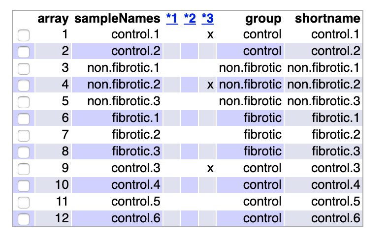
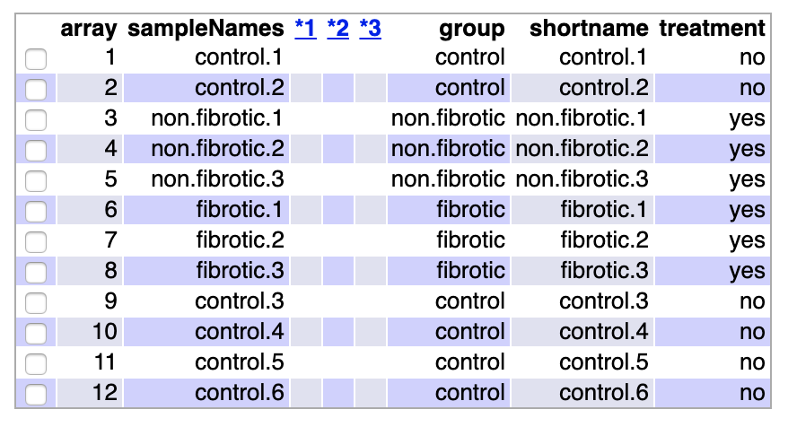

```{r setup, include=FALSE}
knitr::opts_chunk$set(echo = TRUE, tidy.opts=list(width.cutoff=60), fig.pos = 'H')

```


```{r libraries, include=FALSE}
library(knitr)
library(colorspace)
library(gplots)
library(ggplot2)
library(ggrepel)
library(htmlTable)
library(devtools)
library(BiocManager)
library(Biobase)
library(oligo)
library(arrayQualityMetrics)
library(pvca)
library(limma)
library(genefilter)
library(rat2302.db)
library(annotate)
library(org.Rn.eg.db)
library(ReactomePA)
library(reactome.db)
library(magrittr)
library(kableExtra)
```


```{r data, include=FALSE}
# Genero el 'ExpressionSet'
celFiles <- list.celfiles("./Data", full.names = TRUE)
my.targets <-read.AnnotatedDataFrame(file.path("./data","targets.csv"), 
                                     header = TRUE, row.names = 1, 
                                     sep=";") 
rawData <- read.celfiles(celFiles, phenoData = my.targets)
my.targets@data$shortname->rownames(pData(rawData))
colnames(rawData) <-rownames(pData(rawData)) 
myInfo <- new("MIAME",name= "Joaquin Astete Frugoni",
              lab="UOC-ADO",
              contact="jastete0@uoc.edu",
              title="PEC 1")
experimentData(rawData)<-myInfo
```

# Abstract

La Bronquiolitis Obliterante (BO) es una patología que se caracteriza por la fibrosis progresiva e irreversible de la pequeña vía aérea que produce la obstrucción de la misma. En el presente trabajo se analiza la expresión diferencial de genes en un modelo de BO en ratas expuestas a 2,3-Pentadiona. 
Se detectaron diferencias en la expresión de genes involucrados en mecanismos inflamatorios, vías de la matriz extracelular y aparato ciliar. Un análisis específico de estos mecanismos moleculares podrián ser útil para estrageías terapéuticas de esta patología.


## Repostiorio GitHub

https://github.com/joacoastete/PEC-1-analisis-datos-omicos.git


# Objetivos

* Utilizar una base de datos real de **GEO** para plicar los conocimientos aprendidos en la asignatura **Análisis de Datos Ómicos**

* Análisis de genes diferencialmente expresados en muestras de un modelo de BO en ratas

* Establecer que vías moleculares pueden estar involucradas en la BO


# Materiales y Métodos

## Datos

Los datos utilizados para la realización del presente trabajo fueron obtenidos de la base de datos **Gene Expression Omnibus (GEO)**, se ha escogido la serie **[GSE52761](https://www.ncbi.nlm.nih.gov/geo/query/acc.cgi?acc=GSE52761)** que se corresponde con el estudio *"Gene expression in 2,3-Pentanedione Induced Bronchiolitis Oblliterans"*[@morgan2015gene].
Dicho estudio analiza la expresión génica de un modelo en ratas de Bronquiolitis Obliterante al exponerlas a vapores de 2,3-Pentadiona comparados a un grupo control. Luego del análisis histopatológico de los pulmones de las ratas expuestas, se dividian las muestras según si presentaban fibrosis o no presentaban fibrosis
Se han utilizado arrays de la marca Affymetrix® modelo *Rat Genome 230 2.0 Array*
Se han generado las covariantes a partir de la información ofrecida en la  web de **GEO**

## Diseño del experimento

Es un diseño de un factor con tres niveles. El factor es el tejido pulmonar y los niveles: Fibrotico, No fibrotico y control.
Se obtuvieron 6 muestras para el grupo control, 3 muestras para el grupo de Fibrosis y 3 muestras para el grupo de No fibrosis.
En el trabajo original se realizaron las siguientes comparaciones: 

* Fibrosis-Control

* No Fibrosis-Control

En el presente trabajo añadiré la comparación:

* Fibrosis-No fibrosis

Ya que sería interesante saber si analizar si se puede obtener información de genes que podrían intervenir en la protección contra la fibrosis

## Preparación de datos

Los datos se cargarán y analizaran principalmente con las herramientas del proyecto `Bioconductor`.
Una vez cargados los archivos *.CEL* de los arrays y generado el objeto `ExpressionSet`. Se analizó la calidad de los datos a través del paquete`arrayQualityMetrics`.

```{r arrayquality.raw, include=FALSE}
#arrayQualityMetrics(rawData, outdir = file.path("./arrayquality.raw"),force = T)
``` 
```{r, fig.arrayquality , out.width = "200px", out.width = "300px", fig.align="center",fig.cap= "tabla calidad de arrays", echo=FALSE}

```

En la tabla anterior se puede observar que la calidad de los arrays son aceptables ya que no se observa que ningún array tenga más de una columna de metodo de detección de *outlier* marcada.

```{r boxintesidad,echo=FALSE,fig.asp=0.6, fig.align="center", fig.cap="boxplot de intesidades" }
boxplot(rawData, cex.axis=0.5, las=2,  which="all", 
        col = c(rep("red", 2), rep("blue", 3), rep("green", 3), rep("red", 4)),
        main="Distribucion de valores de intensidad")
```

Si bien en el bloxplot anterior cierta variabilidad entres las intensidades no se observa ningún array que pudiera resultar defectuoso.
En el siguiente gráfico se analizan los dos Componentes Principales de los datos

```{r PCA, fig.align="center", fig.asp=0.6, fig.cap= "Grafico de Componente principal", echo=FALSE}
plotPCA3 <- function (datos, labels, factor,scale,colores, size = 1.5, glineas = 0.25) {
  data <- prcomp(t(datos),scale=scale)
  dataDf <- data.frame(data$x)
  Group <- factor
  loads <- round(data$sdev^2/sum(data$sdev^2)*100,1)
  p1 <- ggplot(dataDf,aes(x=PC1, y=PC2)) +
    theme_classic() +
    geom_hline(yintercept = 0, color = "gray70") +
    geom_vline(xintercept = 0, color = "gray70") +
    geom_point(aes(color = Group), alpha = 0.55, size = 3) +
    coord_cartesian(xlim = c(min(data$x[,1])-5,max(data$x[,1])+5)) +
    scale_fill_discrete(name = "Grupo")
  p1 + geom_text_repel(aes(y = PC2 + 0.25, label = labels),segment.size = 0.25, size = size) + 
    labs(x = c(paste("PC1",loads[1],"%")),y=c(paste("PC2",loads[2],"%"))) +  
    ggtitle(paste("Analisis de Componente Principal"))+ 
    theme(plot.title = element_text(hjust = 0.5)) +
    scale_color_manual(values=colores)
}
plotPCA3(exprs(rawData), labels =pData(rawData)$shortname, factor = pData(rawData)$group, 
         scale = FALSE, size = 3, 
         colores = c("red", "blue", "green")) 
```

El primer Componente Principal explica un 53% de la variabilidad que se corresponde con la exposición a 2,3-PD, mientras que el segundo Componente Principal explica un 20% de la variablidad, parecería corresponder con la presencia de fibrosis en el tejido pulmonar. Se observan dos arrays del grupo control que se localizarían en la zona de expuestos al 2,3-PD, por lo que habría que corrobar si están bien etiquetados o si hubo algún porblema con dichas muestras.

### Normalización de datos

Para la normalización de datos se utilizó el método *Robust Multichip Analysis* [@irizarry2003rma]

```{r rma, include=FALSE}
eset_rma <- rma(rawData)
```
```{r boxrma , fig.align="center",echo=FALSE, fig.cap= "boxplot de intensidades-datos normalizados"}
boxplot(eset_rma, cex.axis=0.5, las=2, 
        col = c(rep("red", 2), rep("blue", 3), rep("green", 3), rep("red", 4)),
        main="Distribucion de valores de intensidad: datos normalizados")
```

En el boxplot anterior se observa que el proceso de normalización a funcionado correctamente ya que cada caja del boxplot son casi identicas. Lo que se corrobora con el análisis de `arrayQualityMetrics`:

```{r arrayquality.rma, include=FALSE}
#arrayQualityMetrics(eset_rma, outdir = file.path("./arrayquality.rma"),force = T)
```
```{r fig.qualityrma,out.width = "200px", out.width = "300px",fig.align="center", echo=FALSE, fig.cap="tabla calidad de arrays-datos normalizados"}

```

Ningún array ha sido marcado como posible *outlier*.


```{r PCArma, echo=FALSE, fig.asp=0.6, fig.align="center", fig.cap="Grafico de Componente principal-datos normalizados"}
plotPCA3(exprs(eset_rma), labels =pData(rawData)$shortname, factor = pData(rawData)$group, 
         scale = FALSE, size = 3, 
         colores = c("red", "blue", "green"))
```
En el gráfico de los Componentes Principales de los datos normalizados se observa que la variabilidad por la exposición a 2,3-PD ha disminuido escasamente. Habría que corroborar si hay algún problema con la muestra correspondiente con el array *control.1*

### Filtrado de genes

Se utilizó el paquete `genefilter` para filtrar aquellos genes cuya variabilidad podría ser aleatoria, tambíen se han filtrados sondas que no tenían anontación asociada,  de esta manera se puede aumentar la potencia del estudio al disminuir el número de comparaciones.

```{r filter, include=FALSE}
annotation(eset_rma) <- "rat2302.db"
filtered <- nsFilter(eset_rma, 
                     require.entrez = TRUE, remove.dupEntrez = TRUE,
                     var.filter=TRUE, var.func=IQR, var.cutoff=0.75, 
                     filterByQuantile=TRUE, feature.exclude = "^AFFX")
eset_filtered <-filtered$eset
```

Se han filtrado `r dim(exprs(eset_rma))[1]-dim(exprs(eset_filtered))[1]` genes, quedando en el conjunto de datos un total de `r dim(exprs(eset_filtered))[1]` genes para analizar. 
 
## Análisis de datos

Para la selección de genes diferencialmente expresados he utilizado el método de *Modelos lineales para Microarrays* a través del paquete `limma`. 
Para el diseño de la matriz de contrastes, he establecido los siguientes contrastes:

* Fibrosis-Control

* No Fibrosis-Control

* Fibrosis-No fibrosis

toptable
Para el ajuste de los *p-valores* para comparaciones múltiples se ha utilizado el método de *False discovery Rate* propuesto por Benjamini and Hochberg [@Benjamini1995]
Para las anotaciones de los genes de las sondas empleadas, se ha utilizado la base de datos `rat2302.db` correspondiente al modelo de microarray utilizado. 
Para la selección y visualización de los genes diferencialmente expresados se ha utilizado un valor de corte de *FDR* de 0.05 y de *LogFC* de 1.
Para el análisis de la significación biológica se ha utilizado el método de *Gene Set Enrichment Analysis* a través del paquete `reactomePA`. Se ha establecido como valor de corte de FDR <0.15 y como universo se ha establecido todo los genes que tengan por lo menos una anotación de *Gene Ontology*.

# Resultados


```{r comparaciones, include=FALSE}
designMat<- model.matrix(~0+group, pData(eset_filtered))
colnames(designMat) <- c("control", "fibrotic", "non.fibrotic")
cont.matrix <- makeContrasts (FIBvsCONTROL = fibrotic-control,
                              NONFIBvsCONTROL = non.fibrotic-control,
                              FIBvsNONFIB = fibrotic-non.fibrotic,
                              levels=designMat)
fit<-lmFit(eset_filtered, designMat)
fit.main<-contrasts.fit(fit, cont.matrix)
fit.main<-eBayes(fit.main)
res<-decideTests(fit.main, method="separate", adjust.method="fdr", p.value=0.05, lfc=1)
sum.res.rows<-apply(abs(res),1,sum)
res.selected<-res[sum.res.rows!=0,] 
res.sum<-(summary(res))
```

Al realizar los contrastes entre los diferentes grupos, se seleccionaron los genes que hayan obtenido un valor de FDR menor a 0.05. Para la diferentes comparaciones se obtuvieron los siguientes totales de genes diferncialmente expresados:

* Fibrosis-Control: `r res.sum[1,1]+res.sum[3,1]`

* No Fibrosis-Control: `r res.sum[1,2]+res.sum[3,2]`

* Fibrosis-No fibrosis: `r res.sum[1,3]+res.sum[3,3]`

En la siguiente tabla se puede observar el total de genes *up-regulated* y *down-regulated* para cada comparación

````{r tabla.res, echo=FALSE}
kable(res.sum, "latex", booktabs = T, caption=" Genes especialmente diferenciados entre comparaciones\n FDR<0.05 y logFC <1") %>%
  kable_styling(latex_options ="HOLD_position")
```

A continuación se muestra un diagrama de Venn con los genes seleccionados en común entre las tres comparaciones

```{r venn, echo=FALSE,fig.asp=0.6, fig.align="center", fig.cap="Diagrama de Venn - genes en comun" }
vennDiagram (res.selected[,1:3], cex=0.9)
title("Genes seleccionados en comun entre comparaciones\n FDR < 0.05 y logFC > 1", cex.main = 0.8)
```
 
 En las siguientes tablas se muestran los diez primeros genes ordenados según su *p-valor ajustado* con su correspondiente anotación de cada contraste. 
 
```{r toptab, include=FALSE}
topTab_FIBvsCONTROL <- topTable (fit.main, number=nrow(fit.main), coef="FIBvsCONTROL", adjust="fdr") 
topTab_NONFIBvsCONTROL <- topTable (fit.main, number=nrow(fit.main), coef="NONFIBvsCONTROL", adjust="fdr") 
topTab_FIBvsNONFIB <- topTable (fit.main, number=nrow(fit.main), coef="FIBvsNONFIB", adjust="fdr")
```
```{r comp.annotation, include=FALSE}
annotatedTopTable <- function(topTab, anotPackage)
{
  topTab <- cbind(PROBEID=rownames(topTab), topTab)
  myProbes <- rownames(topTab)
  thePackage <- eval(parse(text = anotPackage))
  geneAnots <- select(thePackage, myProbes, c("SYMBOL", "ENTREZID", "GENENAME"))
  annotatedTopTab<- merge(x=geneAnots, y=topTab, by.x="PROBEID", by.y="PROBEID")
  annotatedTopTab<- annotatedTopTab[with(annotatedTopTab, order(adj.P.Val)),]

  return(annotatedTopTab)
}

topAnnotated_FIBvsCONTROL <- annotatedTopTable(topTab_FIBvsCONTROL,
                                              anotPackage="rat2302.db")
topAnnotated_NONFIBvsCONTROL <- annotatedTopTable(topTab_NONFIBvsCONTROL,
                                               anotPackage="rat2302.db")
topAnnotated_FIBvsNONFIB <- annotatedTopTable(topTab_FIBvsNONFIB,
                                               anotPackage="rat2302.db")
```
```{r, tablas, echo=FALSE}
col.sel<-c("PROBEID","SYMBOL","ENTREZID","GENENAME","adj.P.Val")
kable(topAnnotated_FIBvsCONTROL[1:10,col.sel],  "latex", booktabs = T,row.names = FALSE, caption = "Genes diferencialmente expresados: Fibrosis-Control") %>%
  kable_styling(latex_options = "hold_position")
kable(topAnnotated_NONFIBvsCONTROL[1:10,col.sel], "latex", booktabs = T, row.names = FALSE, caption = "Genes diferencialmente expresados: No Fibrosis-Control") %>%
  kable_styling(latex_options = "HOLD_position")
kable(topAnnotated_FIBvsNONFIB[1:10,col.sel], "latex", booktabs = T, row.names = FALSE, caption = "Genes diferencialmente expresados: Fibrosis-No Fibrosis") %>%
  kable_styling(latex_options = "HOLD_position")

```

En el *heatmap* siguiente, se muestra los genes seleccionados con un *FDR* menor a 0.05 y un  *logFC* mayor a 1, con los genes y muestras agrupados según similitud.

```{r heatmap, include=FALSE}
probesInHeatmap <- rownames(res.selected)
HMdata <- exprs(eset_filtered)[rownames(exprs(eset_filtered)) %in% probesInHeatmap,]
geneSymbols <- select(rat2302.db, rownames(HMdata), c("SYMBOL"))
SYMBOLS<- geneSymbols$SYMBOL
rownames(HMdata) <- SYMBOLS
```
```{r heatmap2, fig.align="center", fig.asp=0.7, fig.cap="Heatmap de expresion con los genes y muestras agrupado por similitud", echo=FALSE}
my_palette <- colorRampPalette(c("blue", "yellow"))(n = 299)
heatmap.2(HMdata,
          Rowv = TRUE,
          Colv = TRUE,
          dendrogram = "both",
          main = "Genes diferencialmente expresados\n FDR < 0,05, logFC >1",
          scale = "row",
          col = my_palette,
          sepcolor = "white",
          sepwidth = c(0.05,0.05),
          cexRow = 0.5,
          cexCol = 0.9,
          key = TRUE,
          keysize = 1.8,
          density.info = "histogram",
          ColSideColors = c(rep("green",2),rep("red",3),rep("blue",3), rep("green",4)),
          tracecol = NULL,
          srtCol = 30)

```

Para el análisis de significación biológica se ha utilizado el método **Gene Set Enrichment Analysis** a través de la herramienta *Reactome Pathway Analysis*. A continuación se muestra, una tabla y un gráfico de tipo *Barplot* con las primeras vías celulares ordenadas según su *p-valor ajustado* para cada comparación realizada

```{r pathway, include=FALSE}
listOfTables <- list(FIBvsCONTROL = topTab_FIBvsCONTROL, 
                     NONFIBvsCONTROL  = topTab_NONFIBvsCONTROL, 
                     FIBvsNONFIB = topTab_FIBvsNONFIB)
listOfSelected <- list()
for (i in 1:length(listOfTables)){
  topTab <- listOfTables[[i]]
  whichGenes<-topTab["adj.P.Val"]<0.15
  selectedIDs <- rownames(topTab)[whichGenes]
  EntrezIDs<- select(rat2302.db, selectedIDs, c("ENTREZID"))
  EntrezIDs <- EntrezIDs$ENTREZID
  listOfSelected[[i]] <- EntrezIDs
  names(listOfSelected)[i] <- names(listOfTables)[i]
}
mapped_genes2GO <- mappedkeys(org.Rn.egGO)
mapped_genes2KEGG <- mappedkeys(org.Rn.egPATH)
mapped_genes <- union(mapped_genes2GO , mapped_genes2KEGG)
```
```{r reactome, results='asis', fig.align='center',fig.cap=paste0("Barplot Reactome - ",comparisonsNames), echo=FALSE}
comparisonsNames <- names(listOfSelected)
universe <- mapped_genes
for (i in 1:length(listOfSelected)){
genesIn <- listOfSelected[[i]]
comparison <- comparisonsNames[i]
enrich.result <- enrichPathway(gene = genesIn,
                                  pvalueCutoff = 0.05,
                                  readable = T,
                                  pAdjustMethod = "BH",
                                  organism = "rat",
                                  universe = universe)
tab<-as.data.frame(enrich.result)[1:5, 1:6]
tabla<-kable(tab, "latex", booktabs = T,row.names = FALSE, caption =paste0("Reactome Pathway Analysis para la comparacion ",comparison)) %>% kable_styling(latex_options = c("scale_down","HOLD_position"),full_width = F)
print(tabla)
cat("\n")
print(barplot(enrich.result, title=paste0("Reactome Pathway Analysis para la comparacion\n ",comparison),showCategory = 15, font.size = 3))
}

```

Se observa que las vías implicadas con el sistema ciliar y con la matriz celular están presente en los tres constrastes. Cabe destacar que en los contrastes de las muestras con fibrosis, también se ven implicadas vías relacionadas con mecanismos inflamatorios (degranulación de neutrofilos, activación del complemento, señalización de citoquinas). Matriz extracelular

# Discusión
cantidad de genes
En el presente trabajo se analizó las alteraciones de expresión génica que se pueden encontrar en un modelo en ratas de Bronquiolitis Obliterante. La principal debilidad de este trabajo es el pequeño muestral ya que solo se obstuvieron 3 muestras de tejido fibrótico. También habría que reconsiderar dos muestras de los tejidos control que durante el procesado de datos, se observó que podría ser posibles muestras atípicas.
En el trabajo se mostró que vías relacionadas con mecanismos inflamatorios podrían estar implicadas en la fisipatogenia de la Bronquiolitis Obliterante según el modelo animal emplado, por lo que habría que ampliar el estudio de estas vías para corroborar dicha hipotestis.

# Apéndice

Código R utilizado para realizar el análisis

```{r apendice, eval=FALSE, tidy=FALSE}
library(knitr)
library(colorspace)
library(gplots)
library(ggplot2)
library(ggrepel)
library(htmlTable)
library(devtools)
library(BiocManager)
library(Biobase)
library(oligo)
library(arrayQualityMetrics)
library(pvca)
library(limma)
library(genefilter)
library(rat2302.db)
library(annotate)
library(org.Rn.eg.db)
library(ReactomePA)
library(reactome.db)
library(magrittr)
library(kableExtra)

# Genero el 'ExpressionSet'
celFiles <- list.celfiles("./Data", full.names = TRUE)
my.targets <- read.AnnotatedDataFrame(file.path("./Data", 
    "targets.csv"), header = TRUE, row.names = 1, sep = ";")
rawData <- read.celfiles(celFiles, phenoData = my.targets)
rownames(pData(rawData)) <- my.targets@data$shortname
colnames(rawData) <- rownames(pData(rawData))
myInfo <- new("MIAME", name = "Joaquin Astete Frugoni", 
    lab = "UOC-ADO", contact = "jastete0@uoc.edu", 
    title = "PEC 1")
experimentData(rawData) <- myInfo

# Utilizo la funcion 'arrayQualityMetrics' para la busqueda de outliers
arrayQualityMetrics(rawData, outdir = file.path("./arrayquality.raw"), 
    force = T)


# Genero graficos para valorar la calidad de los datos

boxplot(rawData, cex.axis = 0.5, las = 2, which = "all", 
    col = c(rep("red", 2), rep("blue", 3), rep("green", 
        3), rep("red", 4)), 
    main = "Distribucion de valores de intensidad")


plotPCA3 <- function(datos, labels, factor, scale, 
    colores, size = 1.5, glineas = 0.25) {
    data <- prcomp(t(datos), scale = scale)
    dataDf <- data.frame(data$x)
    Group <- factor
    loads <- round(data$sdev^2/sum(data$sdev^2) * 100, 
        1)
    p1 <- ggplot(dataDf, aes(x = PC1, y = PC2)) + theme_classic() + 
        geom_hline(yintercept = 0, color = "gray70") + 
        geom_vline(xintercept = 0, color = "gray70") + 
        geom_point(aes(color = Group), alpha = 0.55, 
            size = 3) + coord_cartesian(xlim = c(min(data$x[, 
        1]) - 5, max(data$x[, 1]) + 5)) + scale_fill_discrete(name = "Grupo")
    p1 + geom_text_repel(aes(y = PC2 + 0.25, label = labels), 
        segment.size = 0.25, size = size) + labs(x = c(paste("PC1", 
        loads[1], "%")), y = c(paste("PC2", loads[2], 
        "%"))) + ggtitle(paste("Analisis de Componente Principal")) + 
        theme(plot.title = element_text(hjust = 0.5))
    scale_color_manual(values = colores)
}
plotPCA3(exprs(rawData), labels = pData(rawData)$shortname, 
    factor = pData(rawData)$group, scale = FALSE, size = 3, 
    colores = c("red", "blue", "green"))

# Normalizo los datos con el metodo 'RMA'
eset_rma <- rma(rawData)

# Valoro la calidad de los datos normalizados

boxplot(eset_rma, cex.axis = 0.5, las = 2, col = c(rep("red", 
    2), rep("blue", 3), rep("green", 3), rep("red", 
    4)),
    main = "Distribucion de valores de intensidad: datos normalizados")
arrayQualityMetrics(eset_rma, outdir = file.path("./arrayquality.rma"), 
    force = T)


plotPCA3(exprs(eset_rma), labels = pData(rawData)$shortname, 
    factor = pData(rawData)$group, scale = FALSE, size = 3, 
    colores = c("red", "blue", "green"))

# Realizo el filtraje de genes
annotation(eset_rma) <- "rat2302.db"
filtered <- nsFilter(eset_rma, require.entrez = TRUE, 
    remove.dupEntrez = TRUE, var.filter = TRUE, var.func = IQR, 
    var.cutoff = 0.75, filterByQuantile = TRUE, feature.exclude = "^AFFX")
eset_filtered <- filtered$eset

# Establezco la matriz de diseño y de contraste

designMat <- model.matrix(~0 + group, pData(eset_filtered))
colnames(designMat) <- c("control", "fibrotic", "non.fibrotic")
cont.matrix <- makeContrasts(FIBvsCONTROL = fibrotic - 
    control, NONFIBvsCONTROL = non.fibrotic - control, 
    FIBvsNONFIB = fibrotic - non.fibrotic, levels = designMat)

# Genero el modelo lineal
fit <- lmFit(eset_filtered, designMat)
fit.main <- contrasts.fit(fit, cont.matrix)
fit.main <- eBayes(fit.main)
res <- decideTests(fit.main, method = "separate", adjust.method = "fdr", 
    p.value = 0.05, lfc = 1)
sum.res.rows <- apply(abs(res), 1, sum)
res.selected <- res[sum.res.rows != 0, ]
res.sum <- (summary(res))

# Tabla que muestra los genes diferenciados de cada contraste
kable(res.sum, "latex", booktabs = T, 
      caption = " Genes especialmente diferenciados entre comparaciones\n 
      FDR<0.05 y logFC <1") %>% 
    kable_styling(latex_options = "HOLD_position")

# Diagrama de Venn para los genes en comun entre contrasts
vennDiagram(res.selected[, 1:3], cex = 0.9)
title("Genes seleccionados en comun entre comparaciones\n FDR < 0.05 y logFC > 1", 
    cex.main = 0.8)

# Genero las topTable
topTab_FIBvsCONTROL <- topTable(fit.main, number = nrow(fit.main), 
    coef = "FIBvsCONTROL", adjust = "fdr")
topTab_NONFIBvsCONTROL <- topTable(fit.main, number = nrow(fit.main), 
    coef = "NONFIBvsCONTROL", adjust = "fdr")
topTab_FIBvsNONFIB <- topTable(fit.main, number = nrow(fit.main), 
    coef = "FIBvsNONFIB", adjust = "fdr")


# Agrega las anotaciones a las topTables

annotatedTopTable <- function(topTab, anotPackage) {
    topTab <- cbind(PROBEID = rownames(topTab), topTab)
    myProbes <- rownames(topTab)
    thePackage <- eval(parse(text = anotPackage))
    geneAnots <- select(thePackage, myProbes, c("SYMBOL", 
        "ENTREZID", "GENENAME"))
    annotatedTopTab <- merge(x = geneAnots, y = topTab, 
        by.x = "PROBEID", by.y = "PROBEID")
    annotatedTopTab <- annotatedTopTab[with(annotatedTopTab, 
        order(adj.P.Val)), ]
    
    return(annotatedTopTab)
}

topAnnotated_FIBvsCONTROL <- annotatedTopTable(topTab_FIBvsCONTROL, 
    anotPackage = "rat2302.db")
topAnnotated_NONFIBvsCONTROL <- annotatedTopTable(topTab_NONFIBvsCONTROL, 
    anotPackage = "rat2302.db")
topAnnotated_FIBvsNONFIB <- annotatedTopTable(topTab_FIBvsNONFIB, 
    anotPackage = "rat2302.db")

# Genero tablas con un seleccion de genes por contraste

col.sel <- c("PROBEID", "SYMBOL", "ENTREZID", "GENENAME", 
    "adj.P.Val")
kable(topAnnotated_FIBvsCONTROL[1:10, col.sel], "latex", 
    booktabs = T, row.names = FALSE, 
    caption = "Genes diferencialmente expresados: Fibrosis-Control") %>% 
    kable_styling(latex_options = "hold_position")
kable(topAnnotated_NONFIBvsCONTROL[1:10, col.sel], 
    "latex", booktabs = T, row.names = FALSE, 
    caption = "Genes diferencialmente expresados: No Fibrosis-Control") %>% 
    kable_styling(latex_options = "HOLD_position")
kable(topAnnotated_FIBvsNONFIB[1:10, col.sel], "latex", 
    booktabs = T, row.names = FALSE, 
    caption = "Genes diferencialmente expresados: Fibrosis-No Fibrosis") %>% 
    kable_styling(latex_options = "HOLD_position")

# Genero un Heatmap
probesInHeatmap <- rownames(res.selected)
HMdata <- exprs(eset_filtered)[rownames(exprs(eset_filtered)) %in% 
    probesInHeatmap, ]
geneSymbols <- select(rat2302.db, rownames(HMdata), 
    c("SYMBOL"))
SYMBOLS <- geneSymbols$SYMBOL
rownames(HMdata) <- SYMBOLS
my_palette <- colorRampPalette(c("blue", "yellow"))(n = 299)
heatmap.2(HMdata, Rowv = TRUE, Colv = TRUE, dendrogram = "both", 
    main = "Genes diferencialmente expresados\n FDR < 0,05, logFC >1", 
    scale = "row", col = my_palette, sepcolor = "white", 
    sepwidth = c(0.05, 0.05), cexRow = 0.5, cexCol = 0.9, 
    key = TRUE, keysize = 1.8, density.info = "histogram", 
    ColSideColors = c(rep("green", 2), rep("red", 3), 
        rep("blue", 3), rep("green", 4)), tracecol = NULL, 
    srtCol = 30)

# Aplica el Reactome Pathway Analysis a cada contraste y genera
# Una tabla y barplot para cada resultado

listOfTables <- list(FIBvsCONTROL = topTab_FIBvsCONTROL, 
    NONFIBvsCONTROL = topTab_NONFIBvsCONTROL, 
    FIBvsNONFIB = topTab_FIBvsNONFIB)
listOfSelected <- list()
for (i in 1:length(listOfTables)) {
    topTab <- listOfTables[[i]]
    whichGenes <- topTab["adj.P.Val"] < 0.15
    selectedIDs <- rownames(topTab)[whichGenes]
    EntrezIDs <- select(rat2302.db, selectedIDs, c("ENTREZID"))
    EntrezIDs <- EntrezIDs$ENTREZID
    listOfSelected[[i]] <- EntrezIDs
    names(listOfSelected)[i] <- names(listOfTables)[i]
}
mapped_genes2GO <- mappedkeys(org.Rn.egGO)
mapped_genes2KEGG <- mappedkeys(org.Rn.egPATH)
mapped_genes <- union(mapped_genes2GO, mapped_genes2KEGG)


comparisonsNames <- names(listOfSelected)
universe <- mapped_genes
for (i in 1:length(listOfSelected)) {
    genesIn <- listOfSelected[[i]]
    comparison <- comparisonsNames[i]
    enrich.result <- enrichPathway(gene = genesIn, 
        pvalueCutoff = 0.05, readable = T, pAdjustMethod = "BH", 
        organism = "rat", universe = universe)
    tab <- as.data.frame(enrich.result)[1:5, 1:6]
    tabla <- kable(tab, "latex", booktabs = T, row.names = FALSE, 
        caption = paste0("Reactome Pathway Analysis para la comparacion ", 
            comparison)) %>% kable_styling(latex_options = c("scale_down", 
        "HOLD_position"), full_width = F)
    print(tabla)
    cat("\n")
    print(barplot(enrich.result, 
                  title = paste0("Reactome Pathway Analysis para la comparacion\n ",
                                 comparison),
                  showCategory = 15, font.size = 3))
}

```

# Referencias

